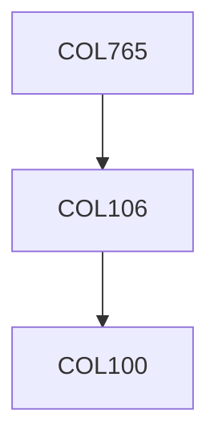

**Credits:** 4 (3-0-2)

**Prerequisites:** [[/Computer Science and Engineering/COL106|COL106]] OR Equivalent

**Overlaps with:** COL226 & COL703

#### Description
Introduction to declarative programming paradigms. The functional style of programming, paradigms of developments of functional programs, use of higher order functionals and pattern-matching. Introduction to lambda calculus. Interpreters for functional languages and abstract machines for lazy and eager lambda calculi, Types, type-checking and their relationship to logic. Logic as a system for declarative programming. The use of pattern-matching and programming of higher order functions within a logic programming framework. Introduction to symbolic processing. The use of resolution and theorem-proving techniques in logic programming. The relationship between logic programming and functional programming.

### Prerequisite Tree

