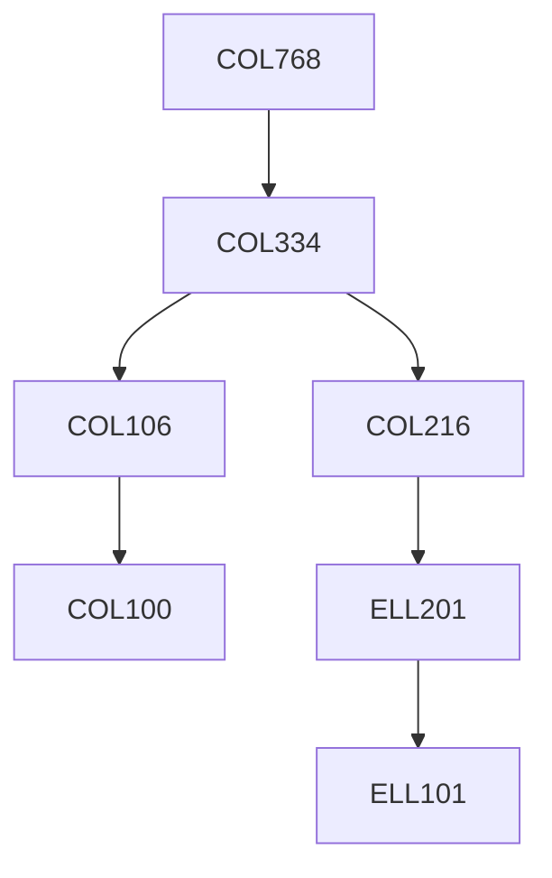

**Credits:** 4 (3-0-2)

**Prerequisites:** [[/Computer Science and Engineering/COL334 | COL334]] OR Equivalent

#### Description 
Radio signal propagation, advanced modulation and coding, medium access techniques, self-configurable networks, mesh networks, cognitive radio and dynamic spectrum access networks, TCP over wireless, wireless security, emerging applications.

### Prerequisite Tree

