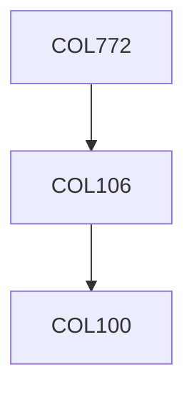

**Credits:** 4 (3-0-2)

**Prerequisites:** [[/Computer Science and Engineering/COL106|COL106]] OR Equivalent

**Overlaps with:** MTL785

#### Description
NLP concepts: Tokenization, lemmatization, part of speech tagging, noun phrase chunking, named entity recognition, co-reference resolution, parsing, information extraction, sentiment analysis, question answering, text classification, document clustering, document summarization, discourse, machine translation.

Machine learning concepts: Naïve Bayes, Hidden Markov Models, EM, Conditional Random Fields, MaxEnt Classifiers, Probabilistic Context Free Grammars.

### Prerequisite Tree

