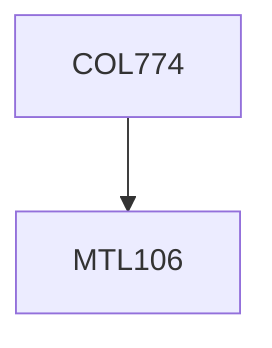

**Credits:** 4 (3-0-2)

**Prerequisites:** [[/Mathematics/MTL106|MTL106]] OR Equivalent

**Overlaps with:** COL341 ELL784, ELL888

#### Description
Supervised learning algorithms: Linear and Logistic Regression, Gradient Descent, Support Vector Machines, Kernels, Artificial Neural Networks, Decision Trees, ML and MAP Estimates, K-Nearest Neighbor, Naive Bayes, Introduction to Bayesian Networks. Unsupervised learning algorithms: K-Means clustering, Gaussian Mixture Models, Learning with Partially Observable Data (EM). Dimensionality Reduction and Principal Component Analysis. Bias Variance Trade- off. Model Selection and Feature Selection. Regularization. Learning Theory. Introduction to Markov Decision Processes. Application to Information Retrieval, NLP, Biology and Computer Vision. Advanced Topics.

### Prerequisite Tree

