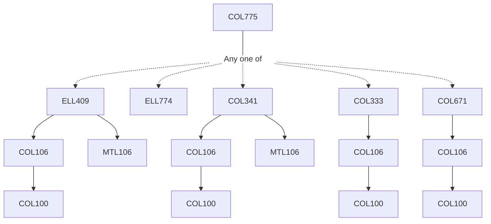

**Credits:** 4 (3-0-2)

**Prerequisites:** Any one of [[/Electrical Engineering/ELL409 | ELL409]]/[[/Electrical Engineering/ELL774 | ELL774]] / [[/Computer Science and Engineering/COL341 | COL341]]/ [[/Computer Science and Engineering/COL333 | COL333]]/ [[/Computer Science and Engineering/COL671 | COL671]]

**Overlaps with:** AIL721, APL745

#### Description 
Basics: Introduction, Why Deep Learning, Multi-layered Perceptron, Neural Networks as Universal Function Approximators, Backpropagation, Regularization, Ll-L2 Norms, Early Stopping, Dropouts. Optimization: Stochastic Gradient Descent, First-order and second order methods, Algorithms such as RMSProp, Adams, AdaGrad. Other Topics on Advanced Optimization. Convolutional Networks (CNNs) - kernels, pooling operations, Applications to Computer Vision. Recurrent Neural Networks, LSTMs, Attention, Transformers, Language models: BERT, GPT2 etc. Applications in NLP. Generative Models: Variational Auto-encoders, Generative Adversarial Networks (GANs). Graph Convolutional Networks, Graph Attention Networks, and variations. Deep Reinforcement Learning - basics of (Deep) RL, More Advanced topics such as visual question answering, Neuro-symbolic reasoning, self-supervised learning, Explainability and Fairness, Domain Adaptation etc.

### Prerequisite Tree

