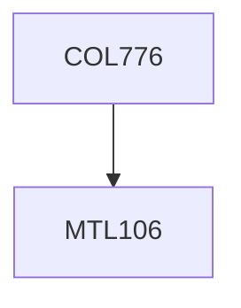

**Credits:** 4 (3-0-2)

**Prerequisites:** [[/Mathematics/MTL106|MTL106]] OR Equivalent

#### Description
Basics: Introduction. Undirected and Directed Graphical Models. Bayesian Networks. Markov Networks. Exponential Family Models. Factor Graph Representation. Hidden Markov Models. Conditional Random Fields. Triangulation and Chordal Graphs. Other Special Cases: Chains, Trees. Inference: Variable Elimination (Sum Product and Max-Product). Junction Tree Algorithm. Forward Backward Algorithm (for HMMs). Loopy Belief Propagation. Markov Chain Monte Carlo. Metropolis Hastings. Importance Sampling. Gibbs Sampling. Variational Inference. Learning: Discriminative Vs. Generative Learning. Parameter Estimation in Bayesian and Markov Networks. Structure Learning. EM: Handling Missing Data. Applications in Vision, Web/IR, NLP and Biology. Advanced Topics: Statistical Relational Learning, Markov Logic Networks.

### Prerequisite Tree

