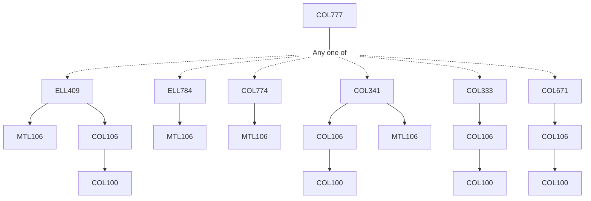

**Credits:** 4 (3-0-2)

**Prerequisites:** Any one of [[/Electrical Engineering/ELL409|ELL409]]/[[/Electrical Engineering/ELL784|ELL784]]/[[/Computer Science and Engineering/COL774|COL774]]/[[/Computer Science and Engineering/COL341|COL341]]/ [[/Computer Science and Engineering/COL333|COL333]]/[[/Computer Science and Engineering/COL671|COL671]]

**Overlaps with:** AIL722, ELL729

#### Description
Introduction and Basics of RL, Markov Decision Processes (MDPs), Dynamic Programming, Monte Carlo Methods (Prediction), Temporal difference Methods (Prediction), Monte Carlo, TD Method (Control), N-step TD, Eligibility Traces, Model based RL, (Action-)Value Function Approximation, Value Function Approximation, Policy Gradient, Policy Gradient, Recent Applications, Misc./Advanced Topics.

### Prerequisite Tree

