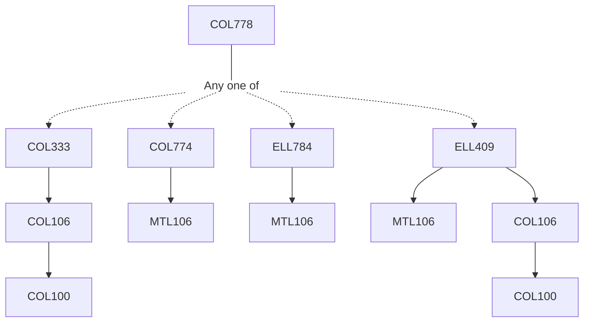

**Credits:** 4 (3-0-2)

**Prerequisites:** Any one of [[/Computer Science and Engineering/COL333|COL333]] / [[/Computer Science and Engineering/COL774|COL774]] / [[/Electrical Engineering/ELL784|ELL784]] / [[/Electrical Engineering/ELL409|ELL409]]

#### Description
Intelligent Agent/Robot Representation. Software and simulation tools. Classical Planning. Anytime and incremental search. Decision- making under Uncertainty. Reinforcement Learning. Imitation learning. State Estimation using Bayesian Networks. Particle Filtering. World Representations. Map representations. Exploration and coverage. Interaction and Intent Inference. Execution and monitoring. Advanced epics and case study. Programming Assignments.

### Prerequisite Tree

