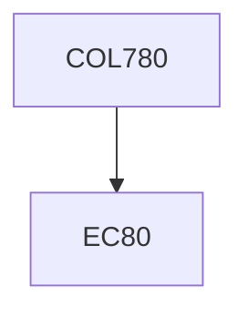

**Credits:** 4 (3-0-2)

**Prerequisites:** EC 80

**Overlaps with:** ELL793

#### Description
Camera models. Calibration, multi-views projective geometry and invariants. Feature detection, correspondence and tracking. 3D structure/motion estimation. Application of machine learning in object detection and recognition, category discovery, scene and activity interpretation.

### Prerequisite Tree

