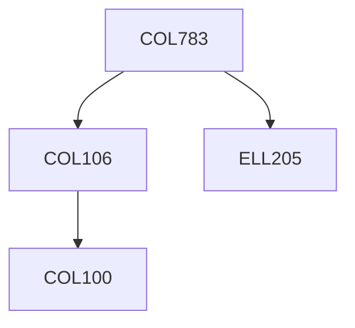

**Credits:** 4.5 (3-0-3)

**Prerequisites:** [[/Computer Science and Engineering/COL106|COL106]], [[/Electrical Engineering/ELL205|ELL205]] OR Equivalent

**Overlaps with:** ELL715

#### Description
Digital Image Fundamentals; Image Enhancement in Spatial Domain:

Gray Level Transformation, Histogram Processing, Spatial Filters; Image Transforms: Fourier Transform and their properties, Fast Fourier Transform, Other Transforms; Image Enhancement in Frequency Domain; Color Image Processing; Image Warping and Restoration; Image Compression; Image Segmentation: edge detection, Hough transform, region based segmentation; Morphological operators; Representation and Description; Features based matching and Bayes classification; Introduction to some computer vision techniques: Imaging geometry, shape from shading, optical flow; Laboratory exercises will emphasize development and evaluation of image processing methods.

### Prerequisite Tree

