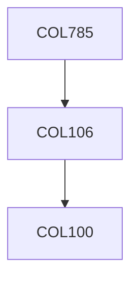

**Credits:** 4 (3-0-2)

**Prerequisites:** [[/Computer Science and Engineering/COL106 | COL106]]

#### Description 
Modeling of VR environments, Basics of lighting and shading, VR/ AR devices and technology, software modules in a VR application, Interaction and manipulation techniques, Locomotion, wayfinding, and orientation in 3D, Multi-user VR and Social interaction.

### Prerequisite Tree

