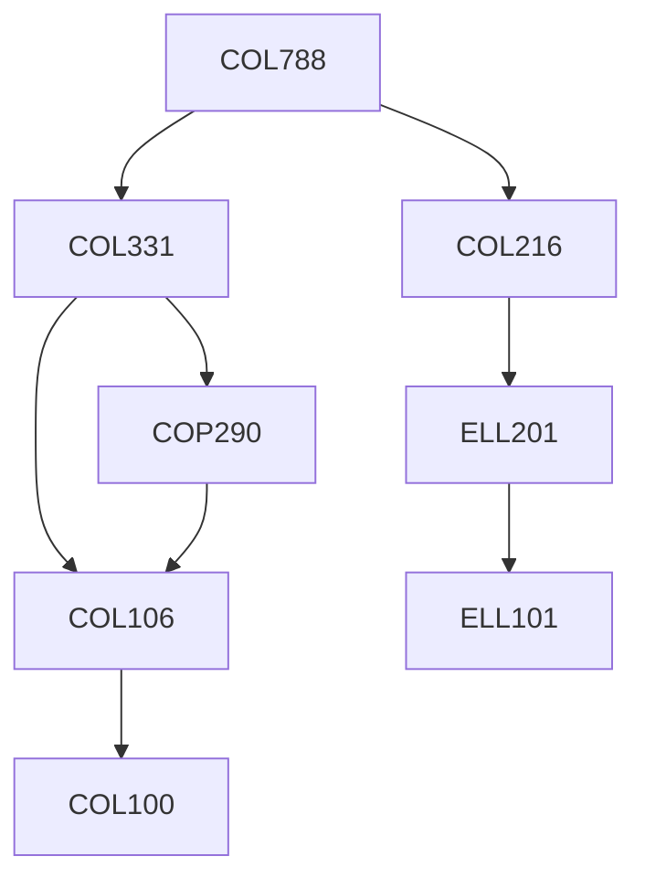

**Credits:** 3 (3-0-0)

**Prerequisites:** [[/Computer Science and Engineering/COL216|COL216]], [[/Computer Science and Engineering/COL331|COL331]] OR Equivalent

**Overlaps with:** ELL782

#### Description
Embedded Platforms, Embedded processor architectures, System initialization, Embedded operating systems (linux) , DSP and graphics acceleration, Interfaces, Device Drivers, Network, Security, Debug support, Performance tuning. The course would involve substantial programming assignments on embedded platforms.

### Prerequisite Tree

