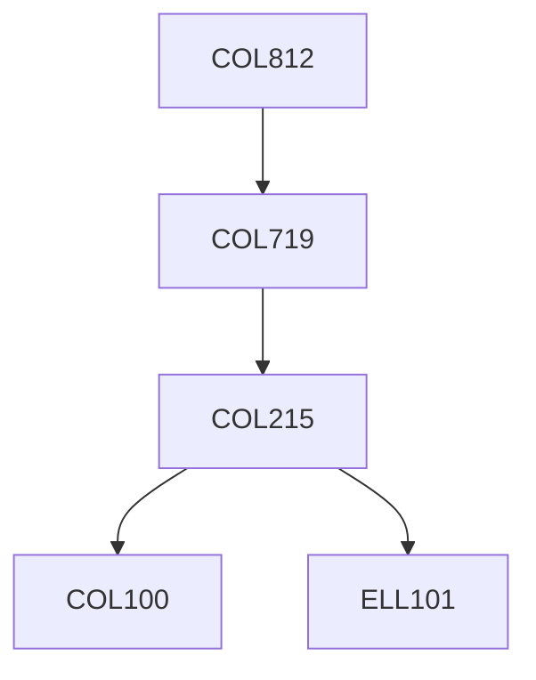

**Credits:** 3 (3-0-0)

**Prerequisites:** [[/Computer Science and Engineering/COL719 | COL719]]

#### Description 
Embedded systems and system-level design, models of computation, specification languages, hardware/software co- design, system partitioning, application specific processors and memory, low power design.

### Prerequisite Tree

