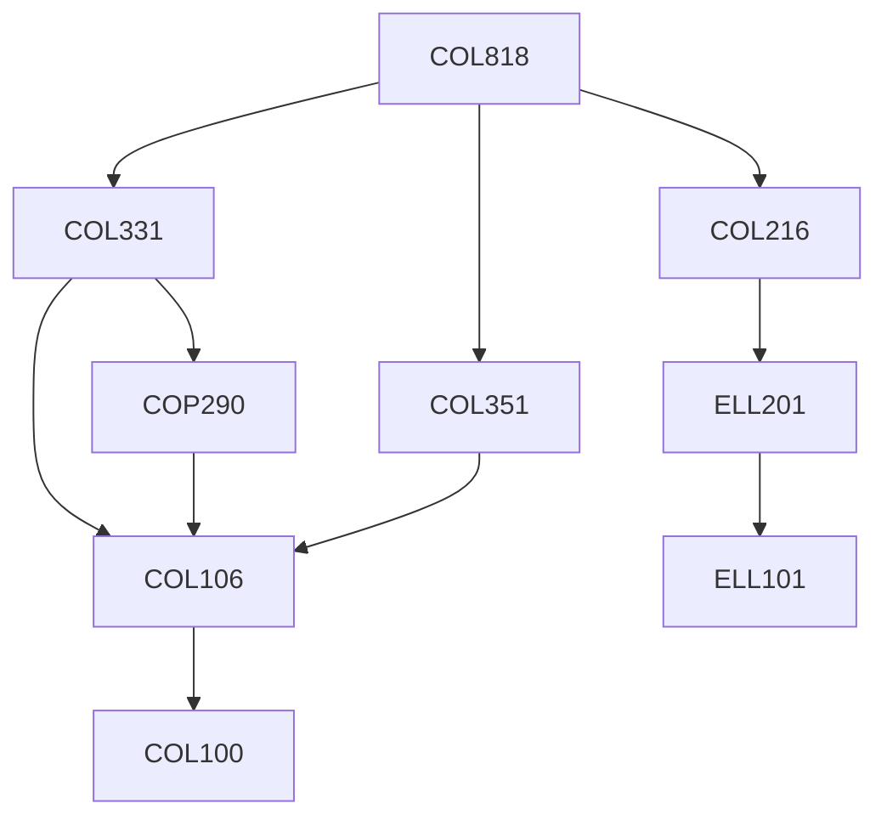

**Credits:** 4 (3-0-2)

**Prerequisites:** [[/Computer Science and Engineering/COL216|COL216]], [[/Computer Science and Engineering/COL351|COL351]], [[/Computer Science and Engineering/COL331|COL331]] OR Equivalent

#### Description
Mutual Exclusion, Coherence and Consistency, Register Constructions , Power of Synchronization Operations , Locks and Monitors, Concurrent queues, Futures and Work-Stealing, Barriers, Basics of Transactional Memory (TM), Regular Hardware TMs, Unbounded HadwareTMs, Software TMs.

### Prerequisite Tree

