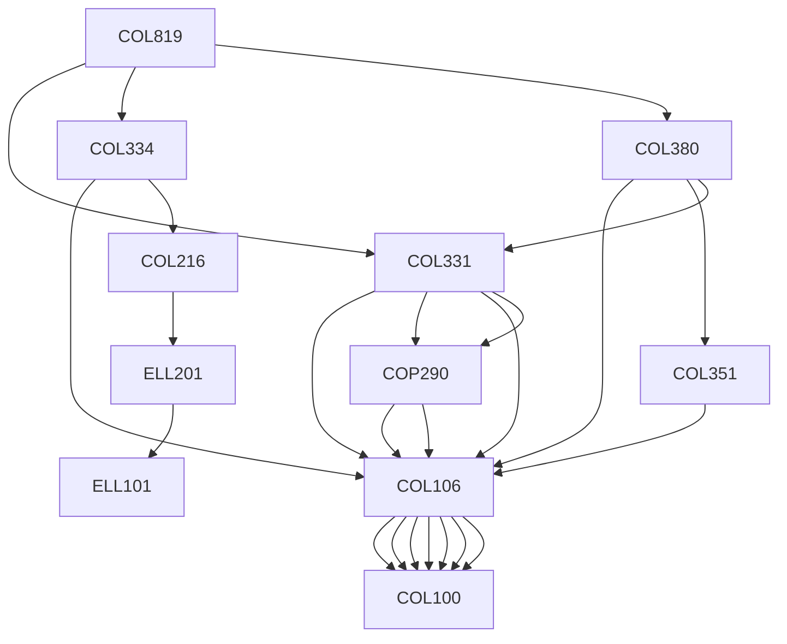

**Credits:** 4 (3-0-2)

**Prerequisites:** [[/Computer Science and Engineering/COL331 | COL331]], [[/Computer Science and Engineering/COL334 | COL334]], [[/Computer Science and Engineering/COL380 | COL380]] OR Equivalent

#### Description 
Epidemic/Gossip based algorithms, Peer to peer networks, Distributed hash tables, Synchronization, Mutual exclusion, Leader election, Distributed fault tolerance, Large scale storage systems, Distributed file systems, Design of social networking systems.

### Prerequisite Tree

