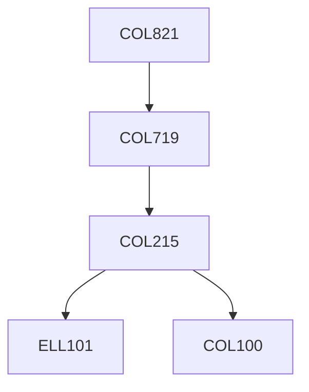

**Credits:** 3 (3-0-0)

**Prerequisites:** [[/Computer Science and Engineering/COL719|COL719]]

#### Description
FPGA architectures, CAD for FPGAs: overview, LUT mapping, timing analysis, placement and routing, Reconfigurable devices - from fine-grained to coarse-grained devices, Reconfiguration modes and multi-context devices, Dynamic reconfiguration, Compilation from high level languages, System level design for reconfigurable systems: heuristic temporal partitioning and ILP-based temporal partitioning, Behavioral synthesis, Reconfigurable example systems’ tool chains.

### Prerequisite Tree

