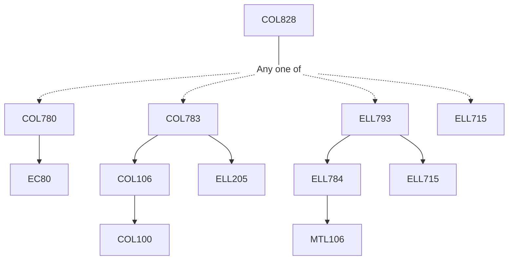

**Credits:** 4 (3-0-2)

**Prerequisites:** [[/Computer Science and Engineering/COL780|COL780]] or [[/Computer Science and Engineering/COL783|COL783]] or [[/Electrical Engineering/ELL793|ELL793]] or [[/Electrical Engineering/ELL715|ELL715]]

#### Description
Advanced topic in computer vision: data sources, features, and learning algorithms useful for understanding and manipulating visual data. Advanced architectures for image classification and visualization of CNNs for image analysis, traditional and modern techniques for object detection, image segmentation, image synthesis, and object tracking. Attack and defense techniques for computer vision systems. Contemporary. Interdisciplinary topics (vision+x) such as vision and language.

### Prerequisite Tree

