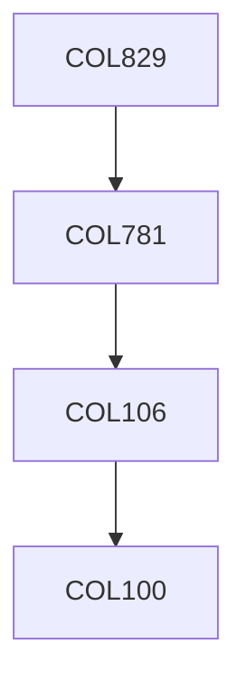

**Credits:** 4 (3-0-2)

**Prerequisites:** [[/Computer Science and Engineering/COL781|COL781]]

#### Description
Rendering: Ray tracing, Radiosity methods, Global illumination models, Shadow generation, Mapping, Anti-aliasing, Volume rendering, Geometrical Modeling: Parametric surfaces, Implicit surfaces, Meshes, Animation: spline driven, quarternions, articulated structures (forward and inverse kinematics), deformation- purely geometric, physically-based, Other advanced topics selected from research papers.

### Prerequisite Tree

