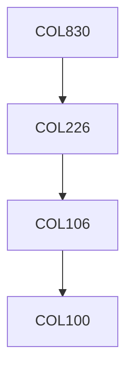

**Credits:** 3 (3-0-0)

**Prerequisites:** [[/Computer Science and Engineering/COL226 | COL226]] OR Equivalent

#### Description 
Models of Distributed Computing; Basic Issues: Causality, Exclusion, Fairness, Independence, Consistency; Specification of Distributed Systems: Transition systems, petri nets, process algebra properties: Safety, Liveness, stability.

### Prerequisite Tree

