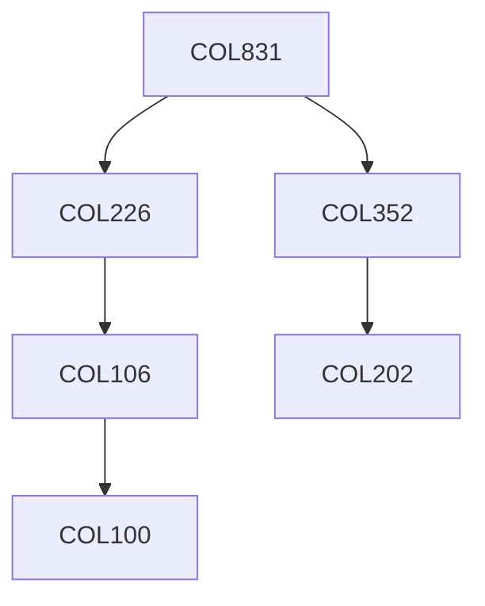

**Credits:** 3 (3-0-0)

**Prerequisites:** [[/Computer Science and Engineering/COL226|COL226]], [[/Computer Science and Engineering/COL352|COL352]]

#### Description
Study of operational, axiomatic and denotational semantics of procedural languages; semantics issues in the design of functional and logic programming languages, study of abstract data types.

### Prerequisite Tree

