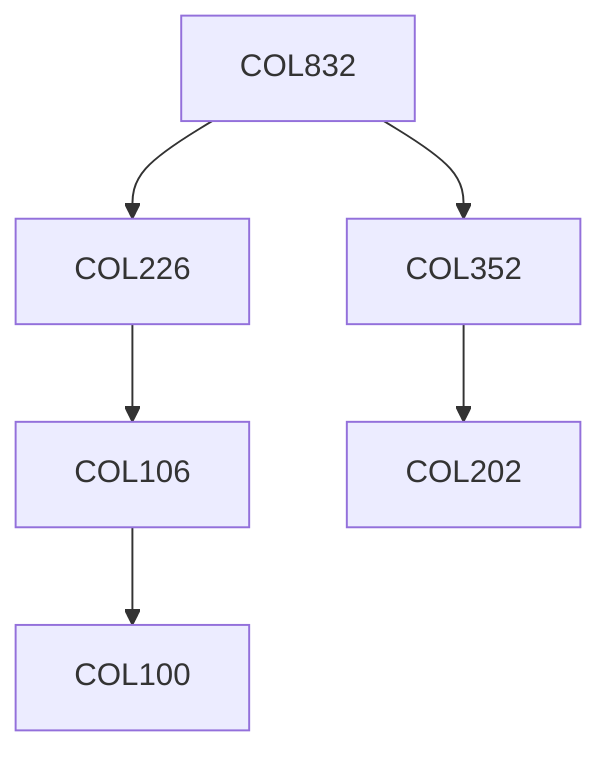

**Credits:** 3 (3-0-0)

**Prerequisites:** [[/Computer Science and Engineering/COL226|COL226]], [[/Computer Science and Engineering/COL352|COL352]]

#### Description
Syntax and semantic foundations: Ranked algebras, homomorphisms, initial algebras, congruences. First-order logic review: Soundness, completeness, compactness. Herbrand models and Herbrand’s theorem, Horn-clauses and resolution. Natural deduction and the Sequent calculus. Normalization and cut elimination. Lambda-calculus and Combinatory Logic: syntax and operational semantics (beta-eta equivalence), confluence and Church-Rosser property. Introduction to Type theory: The simply-typed lambda-calculus, Intuitionistic type theory. Curry-Howard correspondence. Polymorphism, algorithms for polymorphic type inference, Girard and Reynolds’ System F. Applications: type-systems for programming languages; modules and functors; theorem proving, executable specifications.

### Prerequisite Tree

