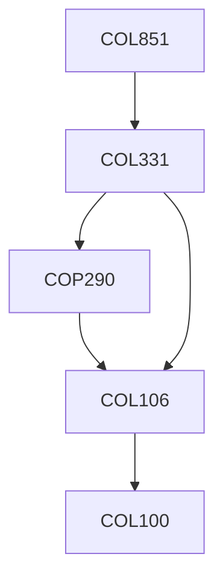

**Credits:** 3 (3-0-0)

**Prerequisites:** [[/Computer Science and Engineering/COL331|COL331]] Or Equivalent

#### Description
To provide insight into current research problems in the area of operating systems. Topics may include, but are not limited to, OS design, web servers, Networking stack, Virtualization, Cloud Computing, Distributed Computing, Parallel Computing, Heterogeneous Computing, etc.

### Prerequisite Tree

