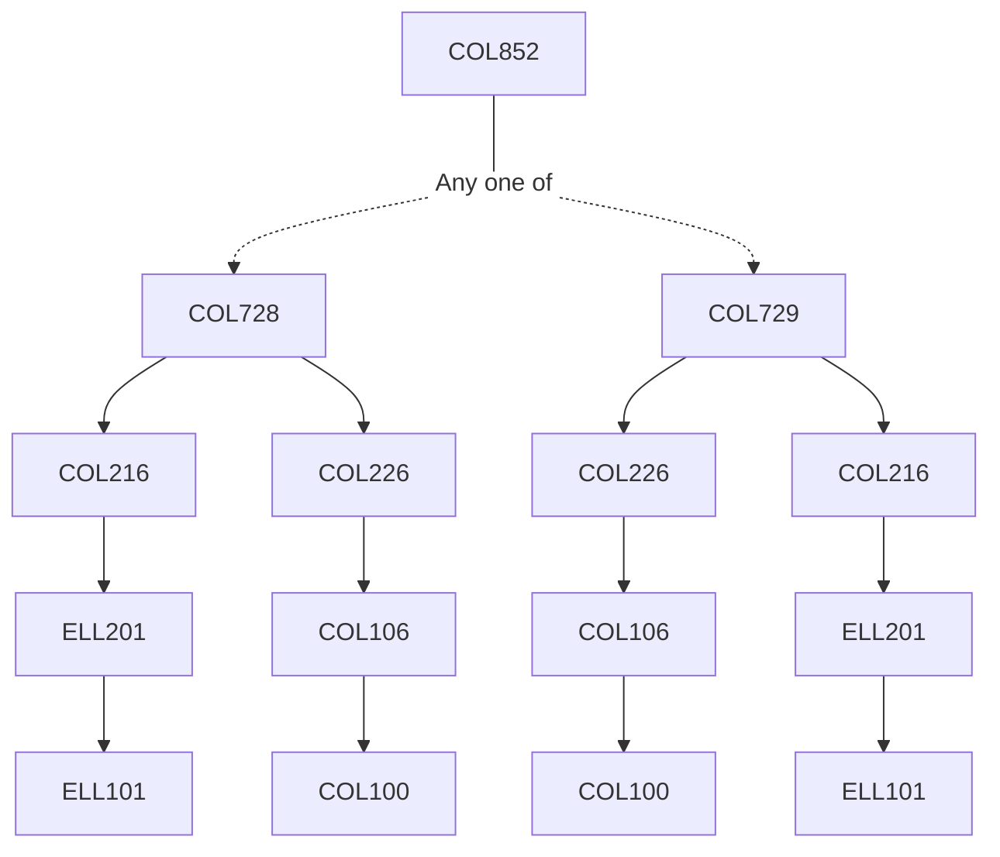

**Credits:** 3 (3-0-0)

**Prerequisites:** [[/Computer Science and Engineering/COL728 | COL728]]/[[/Computer Science and Engineering/COL729 | COL729]]

#### Description 
Special topic that focuses on state of the art and research problems of importance in this area.

### Prerequisite Tree

