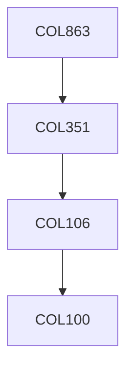

**Credits:** 3 (3-0-0)

**Prerequisites:** [[/Computer Science and Engineering/COL351|COL351]]

#### Description
Under this topic one of the following areas will be covered: Design and Analysis of Sequential and Parallel Algorithms. Complexity issues, Trends in Computer Science Logic, Quantum Computing and Bioinformatics, Theory of computability. Formal Languages. Semantics and Verification issues.

### Prerequisite Tree

