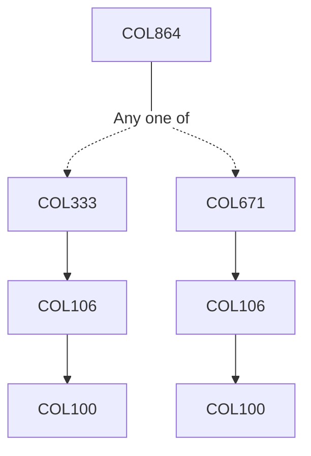

**Credits:** 3 (3-0-0)

**Prerequisites:** [[/Computer Science and Engineering/COL333 | COL333]] / [[/Computer Science and Engineering/COL671 | COL671]] / Equivalent

#### Description 
Potential topics or themes which may be covered (one topic per offering) include: information extraction, industrial applications of AI, advanced logic-based AI, Markov Decision Processes, statistical relational learning, etc.

### Prerequisite Tree

