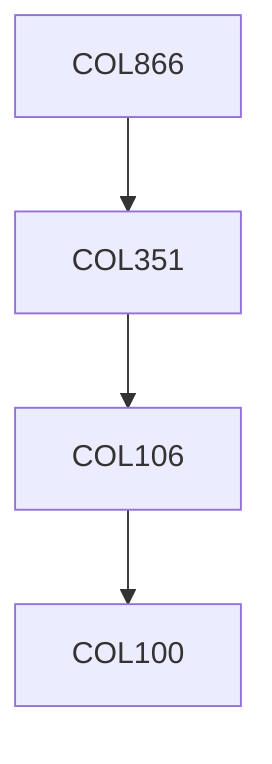

**Credits:** 3 (3-0-0)

**Prerequisites:** [[/Computer Science and Engineering/COL351|COL351]] OR Equivalent

#### Description
The course will focus on specialized topics in areas like Computational Topology, Manufacturing processes, Quantum Computing, Computational Biology, Randomized algorithms and other research intensive topics.

### Prerequisite Tree

