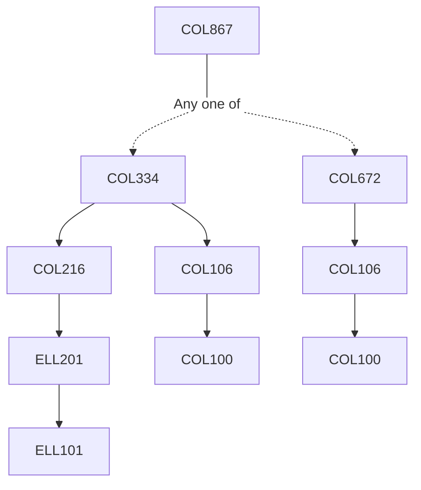

**Credits:** 3 (3-0-0)

**Prerequisites:** [[/Computer Science and Engineering/COL334 | COL334]] OR [[/Computer Science and Engineering/COL672 | COL672]]

#### Description 
The course will be delivered through a mix of lectures and paper reading seminars on advanced topics in Computer Networks. Hands- on projects will be conceptualized to challenge students to take up current research problems in areas such as software defined networking, content distribution, advanced TCP methodologies, delay tolerant networking, data center networking, home networking, green networking, clean state architecture for the Internet, Internet of things, etc.

### Prerequisite Tree

