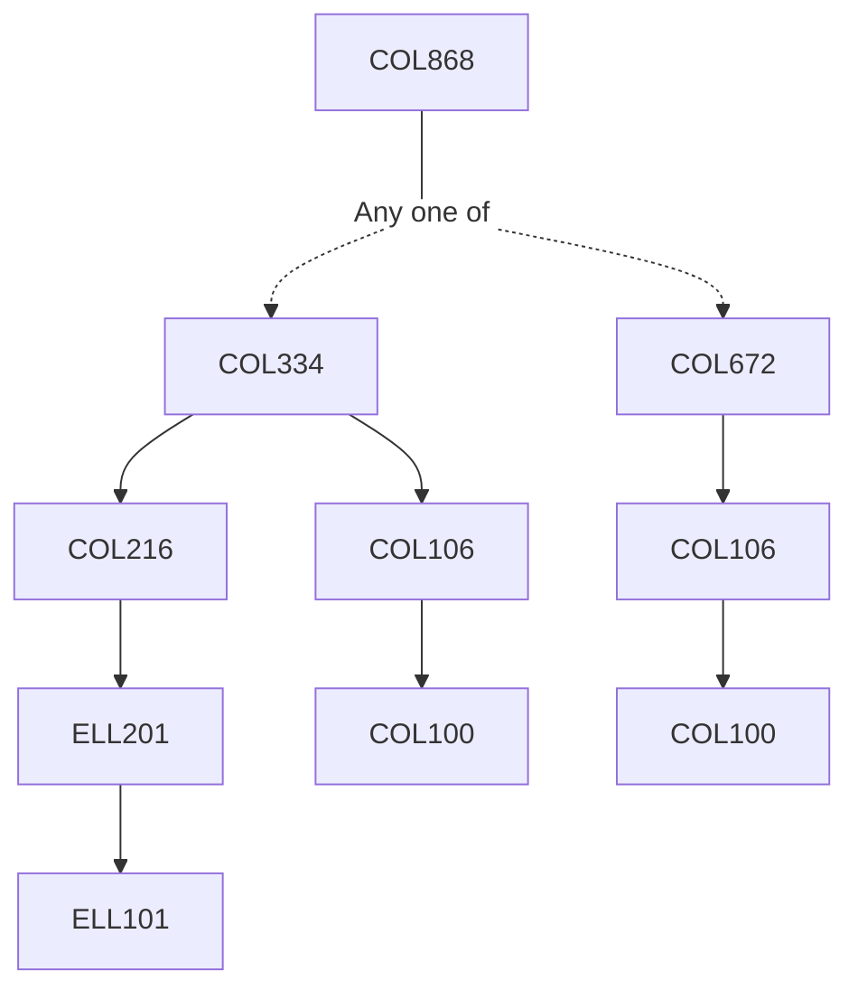

**Credits:** 3 (3-0-0)

**Prerequisites:** [[/Computer Science and Engineering/COL334|COL334]] / [[/Computer Science and Engineering/COL672|COL672]] / Equivalent

#### Description
The contents would include specific advanced topics in Database Management Systems in which research is currently going on in the department. These would be announced every time the course is offered.

### Prerequisite Tree

