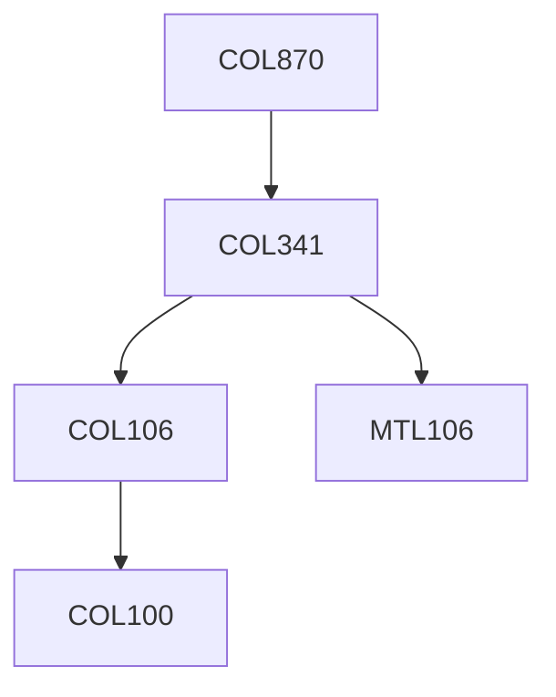

**Credits:** 3 (3-0-0)

**Prerequisites:** [[/Computer Science and Engineering/COL341 | COL341]] OR Equivalent

#### Description 
Contents may vary based on the instructor’s expertise and interests within the broader area of Machine Learning. Example topics include (but not limiting to) Statistical Relational Learning, Markov Logic, Multiple Kernel Learning, Multi-agent Systems, Multi-Class Multi- label Learning, Deep Learning, Sum-Product Networks, Active and Semi-supervised Learning, Reinforcement Learning, Dealing with Very High-Dimensional Data, Learning with Streaming Data, Learning under Distributed Architecture.

### Prerequisite Tree

