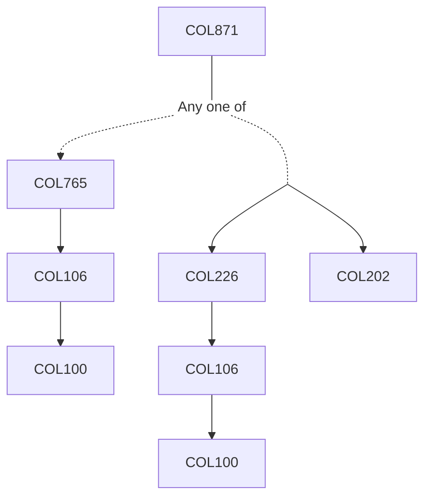

**Credits:** 3 (3-0-0)

**Prerequisites:** [[/Computer Science and Engineering/COL765|COL765]] or ([[/Computer Science and Engineering/COL226|COL226]]+[[/Computer Science and Engineering/COL202|COL202]])

#### Description
The course will focus on one or more specialised research topics such as Operational and Denotational Semantics, Domain Specific Languages, Types Systems, Flow Analysis, Abstract Interpretation, Static Analysis, Program Synthesis, etc.

### Prerequisite Tree

