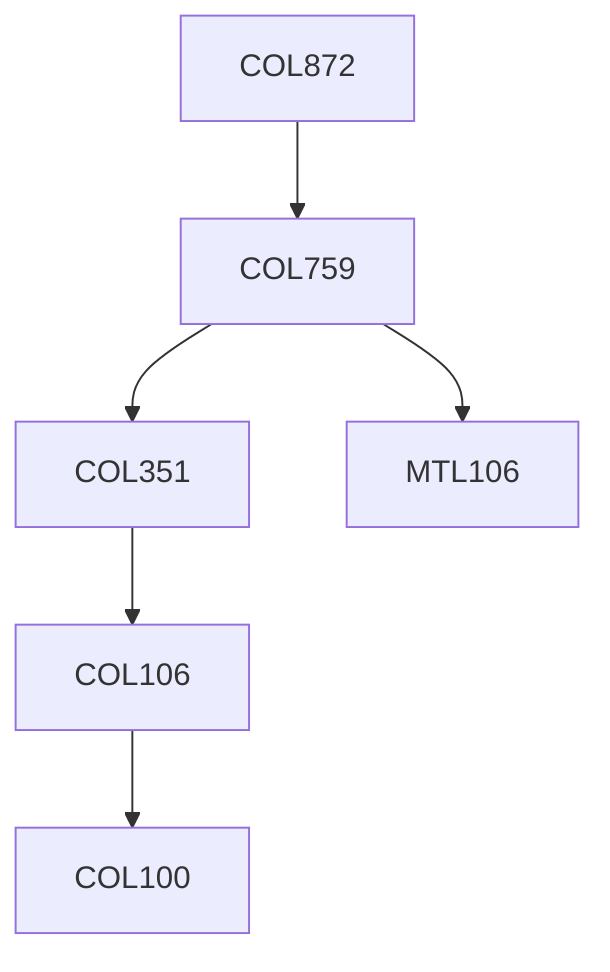

**Credits:** 3 (3-0-0)

**Prerequisites:** [[/Computer Science and Engineering/COL759|COL759]] OR Equivalent

#### Description
Contents may vary based on the instructor’s interests within the broader area of Cryptography. Examples include CCA secure encryption, multiparty computation, leakage resilient cryptography, broadcast encryption, fully homomorphic encryption, obfuscation, functional encryption, zero knowledge, private information retrieval, byzantine agreement, cryptography against extreme attacks etc.

### Prerequisite Tree

