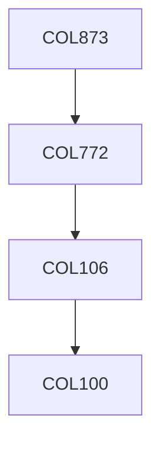

**Credits:** 3 (3-0-0)

**Prerequisites:** [[/Computer Science and Engineering/COL772|COL772]]

#### Description
The course will focus on one or two specialised research topics such as conversational systems, question answering, semantic parsing, representation learning, linguistics in machine learning, automated summarisation systems, etc.

### Prerequisite Tree

