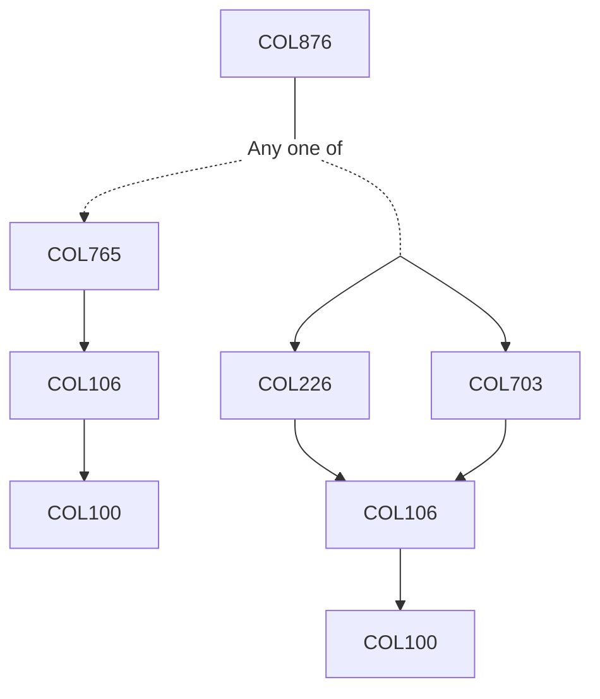

**Credits:** 3 (3-0-0)

**Prerequisites:** [[/Computer Science and Engineering/COL765 | COL765]] or ([[/Computer Science and Engineering/COL703 | COL703]]+[[/Computer Science and Engineering/COL226 | COL226]])

#### Description 
The course will focus on one or more specialised research topics in: Model-checking; theorem-proving; rewriting; abstractions and abstraction refinement; formal frameworks for specification and modelling; game-theoretic techniques; verification of probabilistic systems; Markov decision processes; symbolic-, abstraction- and automata-based methods and algorithms for the verification of hardware, software, hybrid, real-time, concurrent and distributed systems.

### Prerequisite Tree

