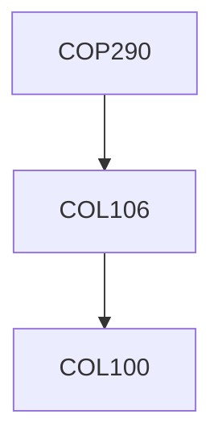

**Credits:** 3 (0-0-6)

**Prerequisites:** [[/Computer Science and Engineering/COL106|COL106]]

#### Description
The contents may differ each year depending on the instructor. The course should involve 2-3 large programming projects done in groups of 2-4.

### Prerequisite Tree

