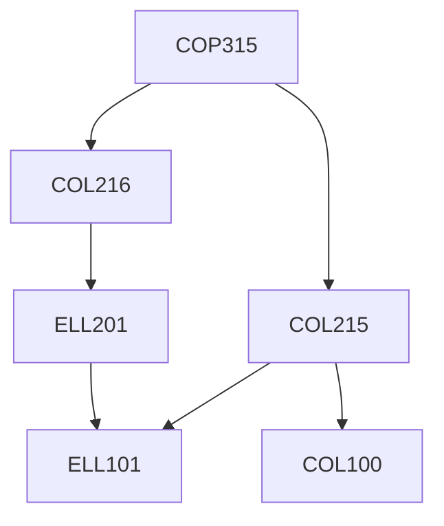

**Credits:** 4 (0-1-6)

**Prerequisites:** [[/Computer Science and Engineering/COL215 | COL215]], [[/Computer Science and Engineering/COL216 | COL216]] or equivalent courses

#### Description 
Students working in small groups of four to six are expected to deliver in one semester on an innovative solution for problems/ challenges that are typical to India and perhaps other developing countries. The students would have to go through the full cycle of specification, design and prototyping/building a concept demonstrator. Key component of the assessment would be through a public demonstration of their solution.

Learning to work in groups as well as planning and delivering a large task are other expected learnings.

### Prerequisite Tree

