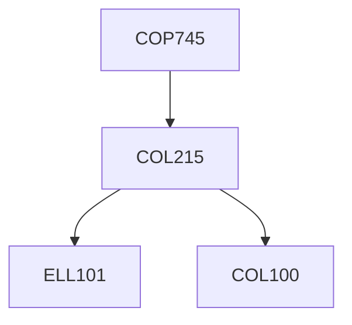

**Credits:** 3 (0-0-6)

**Prerequisites:** [[/Computer Science and Engineering/COL215|COL215]] OR Equivalent

#### Description
Being primarily a laboratory course, it would consist of a series of assignments that would increase in complexity in terms of designs to be carried out. Each assignment would involve learning to translate starting from natural language specifications to HDL design representation. The students would use modern synthesis techniques to realize these designs on FPGA boards before testing them for functionality as well as performance. Students would also be required to specify and implement a project (small system design) as part of the course.

### Prerequisite Tree

