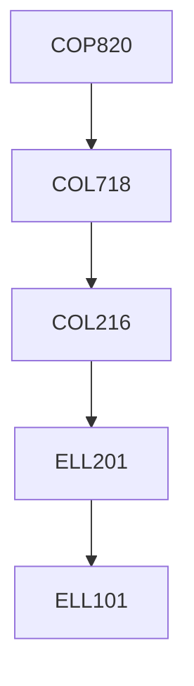

**Credits:** 4 (0-0-8)

**Prerequisites:** [[/Computer Science and Engineering/COL718 | COL718]]

#### Description 
This is a pure laboratory course that invloves the following activities. Design of branch predictors, instruction fetch logic, Decode and rename logic, Instruction window and scheduler, Select logic, Load- square queue, ALUs and by-pass paths, Instruction commit logic, Misprediction and recovery techniques, Selective replay techniques.

### Prerequisite Tree

