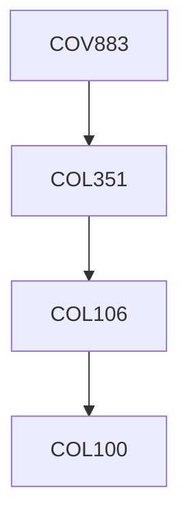

**Credits:** 1 (1-0-0)

**Prerequisites:** [[/Computer Science and Engineering/COL351|COL351]] OR equivalent

#### Description
Special module that focuses on special topics and research problems of importance in this area.

### Prerequisite Tree

