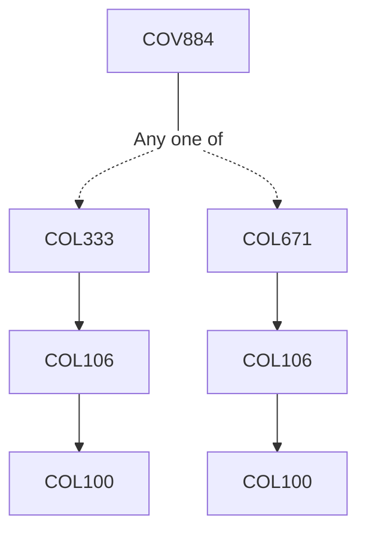

**Credits:** 1 (1-0-0)

**Prerequisites:** [[/Computer Science and Engineering/COL333 | COL333]] / [[/Computer Science and Engineering/COL671 | COL671]] / Equivalent

#### Description 
Special module that focuses on special topics and research problems of importance in this area.

### Prerequisite Tree

