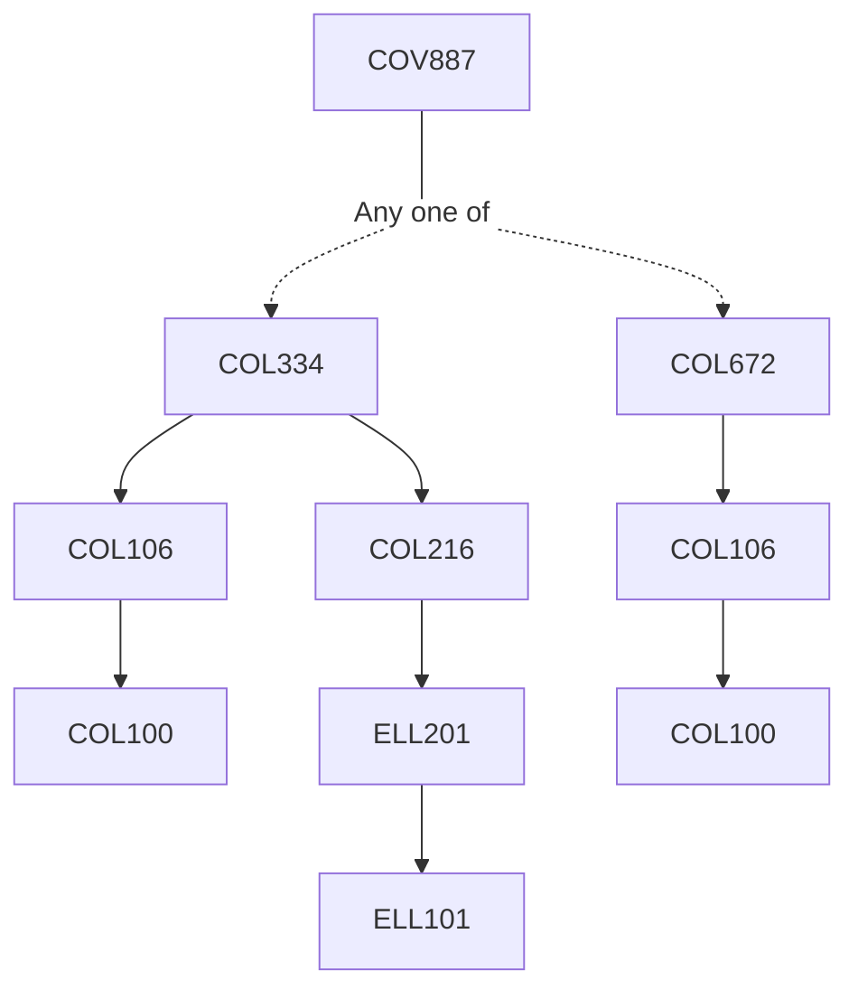

**Credits:** 1 (1-0-0)

**Prerequisites:** [[/Computer Science and Engineering/COL334|COL334]] OR COl 672

#### Description
The course will be delivered through a mix of lectures and paper reading seminars on advanced topics in Computer Networks. Students will be introduced to topics such as software defined networking, content distribution, advanced TCP methodologies, delay tolerant networking, data center networking, home networking, green networking, clean state architecture for the Internet, Internet of things, etc.

### Prerequisite Tree

