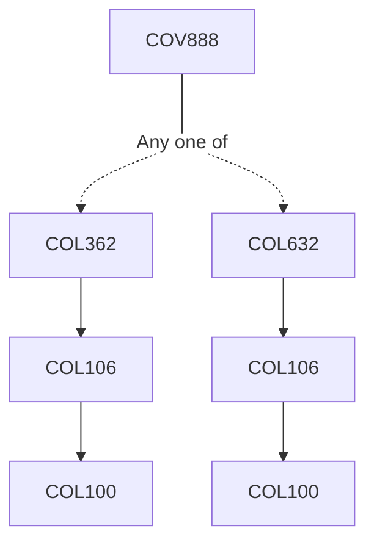

**Credits:** 1 (1-0-0)

**Prerequisites:** [[/Computer Science and Engineering/COL362|COL362]] OR [[/Computer Science and Engineering/COL632|COL632]] OR Equivalent

#### Description
Potential topics or themes which may be covered (one topic per offering) include: data mining, big data management, information retrieval and database systems, semantic web data management, etc.

### Prerequisite Tree

