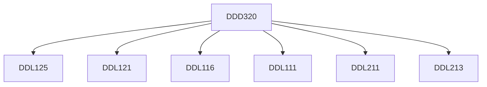

**Credits:** 4 (0-0-8)

**Prerequisites:** [[/Design/DDL111|DDL111]], [[/Design/DDL116|DDL116]], [[/Design/DDL125|DDL125]], [[/Design/DDL121|DDL121]], [[/Design/DDL211|DDL211]], [[/Design/DDL213|DDL213]]

#### Description
Observation, developing questionnaires, conducting interviews, analysis of the present situation, understanding user needs, identifying product/system gaps, ideation - including freehand sketching of possible design solutions, creating multiple formal options, making quick bread board models in paper/foam/mdf for volumetric analysis; creating 2D drawings in CAD, modelling in 3D computer renders and environment simulation, finalization and detailing of the concept in terms of material and processes, assembly techniques; making detailed and accurate components using appropriate model making techniques; detailed and comprehensive presentation about the product and its features; scratch film.

### Prerequisite Tree

