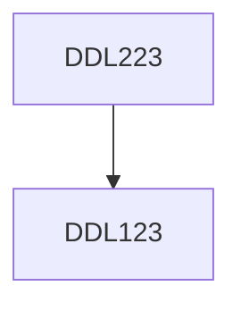

**Credits:** 3 (2-0-2)

**Prerequisites:** [[/Design/DDL123|DDL123]]

#### Description
Design control and display systems, human perception, error, reliability, information processing and awareness, attentional issues in head-up displays, human factors issues in air traffic management. Psychology of the individual. Mistakes in road vehicles.

### Prerequisite Tree

