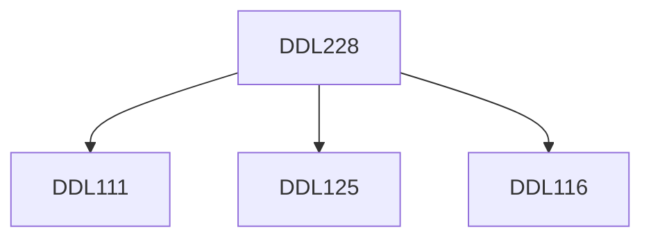

**Credits:** 3 (1-0-4)

**Prerequisites:** [[/Design/DDL111|DDL111]], [[/Design/DDL116|DDL116]], [[/Design/DDL125|DDL125]]

#### Description
Understanding factors that influence human behaviour within predefined spaces, and how to manipulate them. How to create spaces that evoke a certain desired mood, spaces that influence a certain behaviour, spaces that communicate a concept, etc.

### Prerequisite Tree

