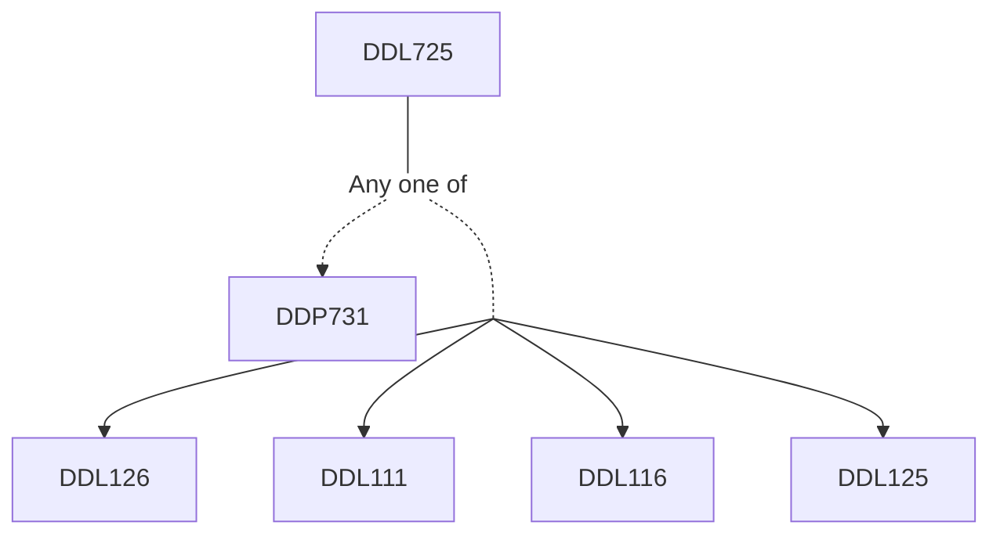

**Credits:** 3 (2-0-2)

**Prerequisites:** [[/Design/DDP731 | DDP731]] or ([[/Design/DDL111 | DDL111]], [[/Design/DDL116 | DDL116]], [[/Design/DDL125 | DDL125]], and [[/Design/DDL126 | DDL126]])

**Overlaps with:** ELL

#### Description 
History of information design; Principles of organization of content & data; Principles of visual design for data displays; Narratives & data story-telling; Types of data; Types &tools of visual representation of data; Preparation of data; Chronological representations; Geographical representations; Visualization of quantitative and abstract data complexity.

### Prerequisite Tree

