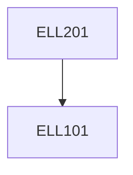

**Credits:** 4.5 (3-0-3)

**Prerequisites:** [[/Electrical Engineering/ELL101|ELL101]]

#### Description
Gates, binary number systems, arithmetic operations. Minimization using K-maps, reduced K-maps, tabular methods; design using multiplexers, decoders, and ROMs. Latches, flip-flops, registers and counters. Asynchronous, synchronous counters. Finite state machines, implementations thereof. Mealy, Moore machines. Clock period computation. Memories. Partitioning and pipelining. VHDL/Verilog, the register-transfer-level description style. Switch level introduction to logic families, CMOS logic, static, pre-charge and clocked logic. Asynchronous circuits and design styles.

### Prerequisite Tree

