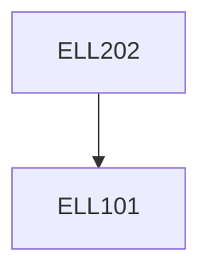

**Credits:** 4 (3-1-0)

**Prerequisites:** [[/Electrical Engineering/ELL101|ELL101]]

#### Description
Overview of network analysis techniques, network theorems, transient and steady-state sinusoidal response. Network graphs and their applications in network analysis. Tellegen’s theorem, two-port networks, Z, Y, h, g, and transmission matrices. Combining two ports in various configurations. Analysis of transmission lines to motivate the scattering matrix. Scattering matrix and its applications in network analysis. Network functions, positive real functions, and network synthesis. Butterworth and Chebyshev approximations. Synthesis of lossless two-port networks. Synthesis of lattice all-pass filters.

### Prerequisite Tree

