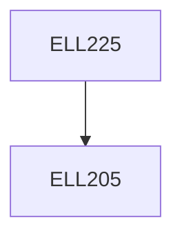

**Credits:** 4 (3-1-0)

**Prerequisites:** [[/Electrical Engineering/ELL205|ELL205]]

**Overlaps with:** MCL212, CLL261

#### Description
Introduction to the control problem, Control System Components:

Sensors, Actuators, Computational blocks. Mathematical representation of systems, state variable model, linearization, transfer function model. Transfer function and state variable models of suitable mechanical, electrical, thermal and pneumatic systems. Closed loop systems, Block diagram and signal flow analysis, Basic Characteristics of feedback control systems: stability, steady-state accuracy, transient accuracy, disturbance rejection, sensitivity analysis and robustness. Basic modes of feedback control: Proportional, Integral, Derivative. Concept of stability, Stability criteria: Routh stability criterion, Mikhailov’s criterion, Kharitonov theorem. Time response of 2nd order system, steady state error analysis. Performance specifications in the time domain. Root locus method of design. Nyquist stability criterion. Frequency response analysis: Nyquist plots, Bode plots, Nichols Charts, Performance specifications in frequency domain, Frequency domain methods of design. Lead lag compensation.

### Prerequisite Tree

