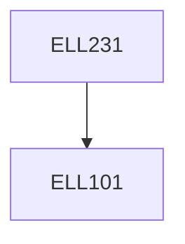

**Credits:** 3 (3-0-0)

**Prerequisites:** [[/Electrical Engineering/ELL101|ELL101]]

#### Description
Introduction to semiconductor basics and PN Junctions. Short introduction to power device technology, PIN diodes, Schottky diodes, Power BJTs, Power MOSFETs, IGBTs, Thyristors, Wide bandgap power semiconductor devices, Packaging and Reliability of Power devices, Destructive mechanisms in power devices, Power device induced oscillations and Electromagnetic disturbances, Selection of power devices in power electronic systems, Smart power integrated circuits.

### Prerequisite Tree

