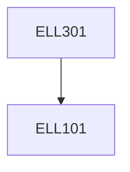

**Credits:** 3 (3-0-0)

**Prerequisites:** [[/Electrical Engineering/ELL101|ELL101]]

#### Description
Basics of Measurement and Instrumentation, Instrument Examples: Galvanometer, Accelerometer etc; calibration methods, Voltage and Current Measurements; Theory, calibration, application, Errors and compensation. Power and Energy Measurement and its errors, Methods of correction, LPF wattmeter, Phantom loading, Induction type KWH meter; Calibration of wattmeter, energy meter. Potentiometer and Instrument Transformer :DC and AC potentiometer, C.T. and V.T. construction, theory, operation, characteristics. Digital Instrumentation.

### Prerequisite Tree

